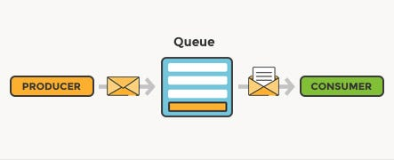

# Message Queues

### What are message queues?
- Messaging queues are systems that allow different applications or services to send messages to each other in a safe and reliable way.
- Think of it like a queue in a bank:
- One system sends a message, puts it in the queue
- Another system reads the message when ready

### Why are message queues used?

Messaging queues solve important problems in large systems:
**1. Decoupling:** Two systems don’t need to know about each other directly.
**2. Reliability:** If one service crashes, messages stay in the queue safely.
**3. Scalability:** Queues can handle millions of messages without breaking.
**4. Async processing:** Useful for tasks that shouldn't block the main app
(e.g., sending emails, payment processing, notifications).
**5. Load Management:** Helps distribute workload smoothly.

### What are the popular messaging queue tools?
- Here are the most commonly used tools:
**1. RabbitMQ**
- Very popular
- Easy to use
- Supports complex routing

**2. Kafka**
- Used for high-speed, real-time data streaming
- Best for big data and event-driven systems

**3. Amazon SQS**
- Cloud-based
- Fully managed by AWS
- Scalable and reliable

**4. Azure Service Bus**
- Microsoft’s enterprise message system
- ActiveMQ
- Apache tool for enterprise messaging

### 4. What is an Enterprise Message Bus (EMB)?

- An Enterprise Message Bus is a larger, more powerful system built for many services to communicate with each other across a big organization.

- You can think of it like:
- A central highway where all services send and receive messages instead of having separate point-to-point connections.

##### References:
- https://www.youtube.com/watch?v=oUJbuFMyBDk
- https://www.geeksforgeeks.org/system-design/message-queues-system-design/
